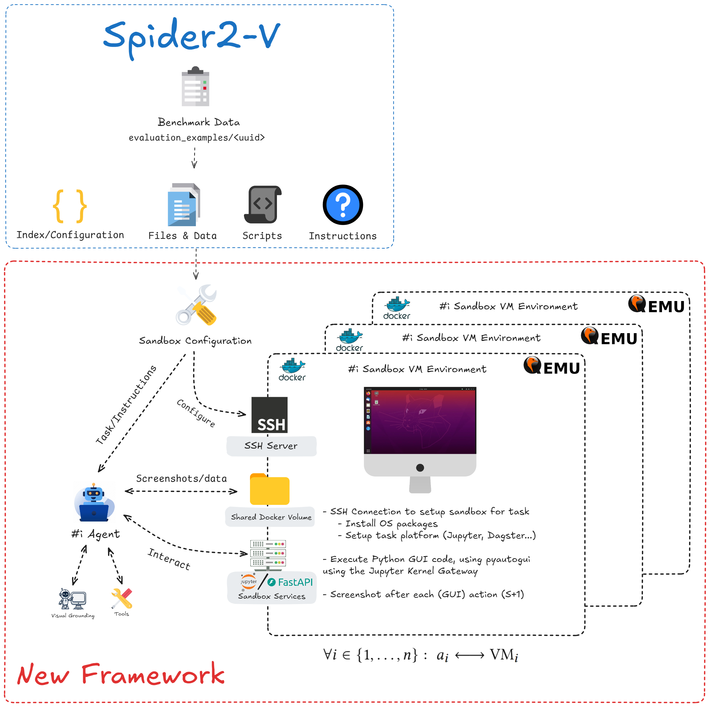
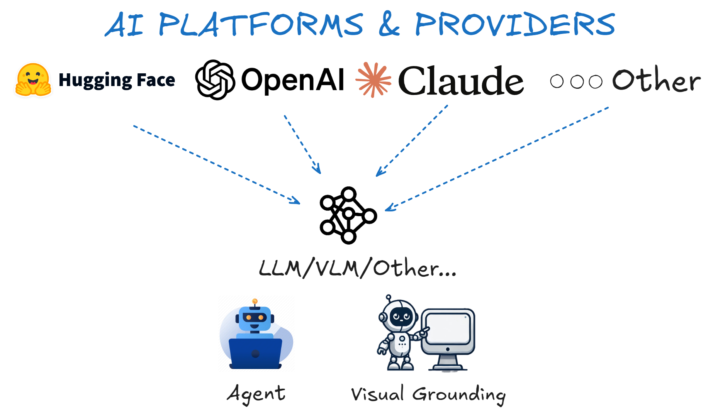
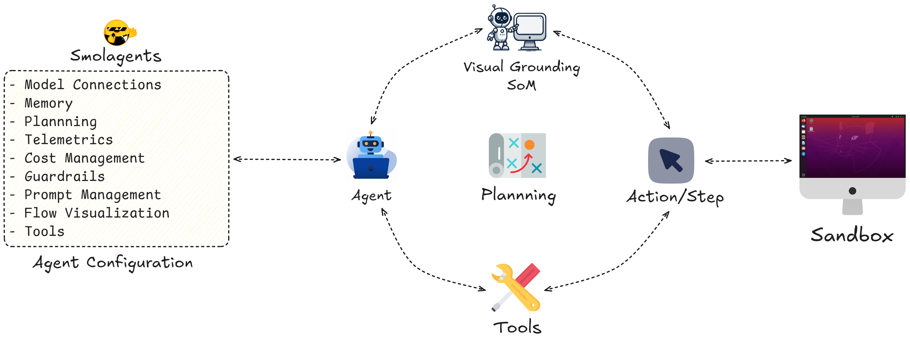
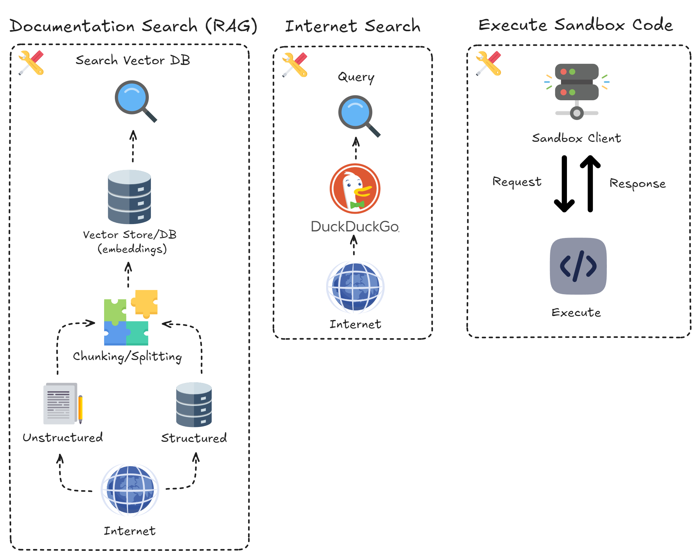

### 1. **Sandboxed VMs via Python‑Driven QEMU + Docker Orchestration**

- At the core is a lightweight Python wrapper over `docker` + QEMU, managing **parallel VMs** spun up inside Docker containers.
- Each VM is isolated, yet controllable via SSH and container-shared mounts.
- VM lifecycle, snapshotting, and network I/O are fully scriptable via Python.
- Configurable in one line — swap OS images or VM templates by simply changing a field in `SandboxVMConfig`.

➡️ **Result**: Fast parallel benchmarks, reproducible environments, and no manual hypervisor tools required.



---

### 2. **In‑VM Services via FastAPI + Jupyter Kernel Gateway**

Inside each guest VM, the benchmark framework runs two cooperating services:

- **FastAPI sandbox server**:

  - Exposes VM-level capabilities like screenshots, GUI event recording (via `pyautogui` + `Xcursor`), file management, and action replay.
  - Fully OpenAPI-compliant with a dynamic client generated by `openapi-python-client`.
  - Enables typed, traceable communication from the orchestrator to in-VM services.

- **Jupyter Kernel Gateway**:
  - Runs Python code inside the VM kernel via WebSockets.
  - Supports `%pip`, `!uv pip install`, dynamic imports — everything an interactive LLM agent needs.
  - Based on the official `uv` kernel setup, with named kernel support and isolation via `uv venv --seed`.

➡️ **Result**: Your agent gets interactive Python + API access inside a full VM — enabling real browser/UI tasks, not just mocks.

---

### 3. **Modular Agents via `smolagents`**

- Agents are built using [`smolagents`](https://github.com/smol-ai/smolagents) — a minimal, composable Python framework.
- Tool-based design: Each capability (e.g., execute, take screenshot, search file system) is just a Python function wrapped in a `Tool`.
- Pluggable `Executor` and `LLMAdapter` backends let you test OpenAI, local HF models (e.g. vLLM, Qwen), or sandbox-executed Python.

➡️ **Result**: Agents can execute code _inside_ the VM, trigger actions, observe outputs, and reflect — all through typed Python tools.





---

### 🔍 Why It Matters

- **Agent Realism**: They don’t just hallucinate — they click, type, install, screenshot, and _run_ code in real VMs.
- **Deterministic CI**: Using `uv` means repeatable Python environments with lockfile‑based execution.
- **Highly Modular**: Swap just the FastAPI interface, the LLM backend, or a tool class — nothing breaks.
- **Scale‑ready**: Each agent has its own isolated OS to play in. Bench 5, 50, or 500 agents with a single orchestrator call.

---

### 🚀 Easy Extension & Baseline Improvement

Because the benchmark is **100% Python**:

- 🧪 Add new tools by writing Python functions.
- 🧩 Compose new agent behaviors using standard function chaining.
- 🧠 Run **ablation studies**, **reflective reasoning**, or **debugging agents** with just Python.
- 🧬 Auto‑generate reproducible runs with no lockfile drift (`uv` handles envs).
- 📦 Package the sandbox server as a versioned PyPI package — coming soon!

---

### 💡 Example Flow

```text
AgentOrchestrator
│
├──▶ Spins up N VMs in Docker
│     ├── Installs FastAPI + Jupyter Gateway inside each VM
│     └── Starts kernel + logs services
│
├──▶ AgentVMManager
│     └── Generates Python client from OpenAPI + binds methods
│
├──▶ Agent (via smolagents)
│     └── Calls tools → API requests → Sandbox executes
│
└──▶ Results saved, screenshots logged, VM auto-destroyed or snapshotted
```

---

## ✅ Summary

> This re-architecture makes **Spider2‑V agent benchmarking scalable, modular, and future‑proof.**
> All in Python. All reproducible. All ready for real-world LLM agents.
