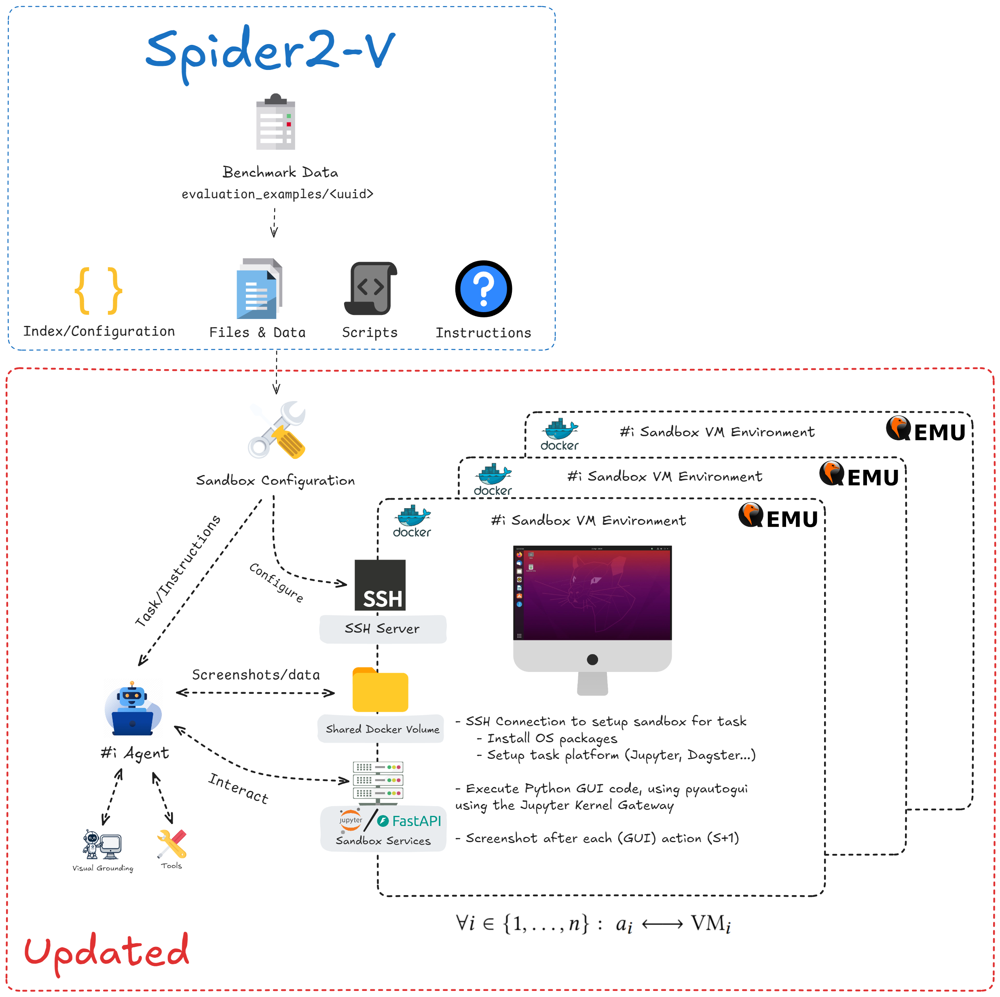

## 🧠 Extending Spider2‑V: A Fully Pythonic, Modular & Future‑Proof Benchmarking Framework

An extension of the Spider2‑V benchmark redesigned for **full Python compatibility**, enabling fast iteration, rich agent–environment interaction, and seamless integration with modern ML infrastructure.

---

### 1. **Sandboxed VMs via Python‑Driven QEMU + Docker Orchestration**

- A lightweight Python wrapper over `docker` + QEMU manages **parallel VMs** inside Docker containers.
- Each VM is isolated but controllable via SSH and container-shared mounts.
- VM lifecycle, snapshotting, and network I/O are fully scriptable via Python.
- One-line configuration allows easy switching between OS images or VM templates using `SandboxVMConfig`.

➡️ **Result**: Fast, reproducible benchmarks in real OS environments with no hypervisor UI required.



---

### 2. **In‑VM Services via FastAPI + Jupyter Kernel Gateway**

Each guest VM hosts two key services:

- **FastAPI sandbox server**:

  - Exposes endpoints for screenshots, GUI event recording (`pyautogui`, `Xcursor`), file access, and more.
  - Fully OpenAPI-compliant and paired with a dynamically generated client (`openapi-python-client`).
  - Enables typed, traceable communication between agents and the virtual environment.

- **Jupyter Kernel Gateway**:
  - Executes Python code within the VM kernel via WebSocket APIs.
  - Supports dynamic imports and `%pip`/`!uv pip install`/`!pip install` for live package management.
  - Based on `uv venv --seed` and kernel registration (`ipykernel`) for full isolation.

➡️ **Result**: Agents interact with real Python execution environments inside the OS — supporting live coding, installation, and inspection.

---

### 3. **Modular Agents via `smolagents`**

- Built on [`smolagents`](https://github.com/smol-ai/smolagents), a composable, Python-native agent framework.
- Tool-based design: each capability (e.g., run code, take screenshot) is defined as a `Tool` (i.e., typed Python function).
- Swappable `Executor` and `LLMAdapter` modules support OpenAI, Hugging Face (e.g., Qwen, vLLM), or sandbox execution.

➡️ **Result**: Fully programmable agents that execute code _inside_ the VM and interact with APIs through typed Python interfaces.


---

### 🔍 Why It Matters

- **Agent Realism** – Agents interact with real UIs and operating systems (not mocks).
- **Deterministic CI** – `uv` guarantees reproducible Python environments with lockfile-based workflows.
- **Modularity** – Replace or extend FastAPI interfaces, tools, or models independently.
- **Scalability** – Each agent has a full VM; scale benchmarking across 1, 5, or x agents concurrently (if you have the compute/resources 😉).

---

### 🚀 Easy Extension & Baseline Improvement

With the benchmark defined in pure Python:

- 🧪 Prototype new tools in minutes as standalone Python functions.
- 🧩 Compose or ablate agent behaviors for insight-driven testing.
- 🧠 Implement advanced logic (self-critique, chain-of-thought, debugging) using `smolagents`.
- 🧬 Guarantee reproducibility across environments via `uv`’s lockfile support.
- 📦 Package and distribute VM-side services as standard Python packages (future work).

---

### 💡 Example Flow

```text
AgentOrchestrator
│
├──▶ Spins up N VMs in Docker
│     ├── Installs FastAPI + Jupyter Gateway inside each VM
│     └── Starts kernel + logs services
│
├──▶ AgentVMManager
│     └── Generates Python client from OpenAPI + binds methods
│
├──▶ Agent (via smolagents)
│     └── Calls tools → API requests → Sandbox executes
│
└──▶ Results saved, screenshots logged, VM auto-destroyed or snapshotted
```

---

## ✅ Summary

> A scalable, modular re-architecture of Spider2‑V that brings LLM agent benchmarking into a fully Pythonic, reproducible, and extensible framework.
> Ideal for real-world tool use, advanced agent behaviors, and fast experimentation.
